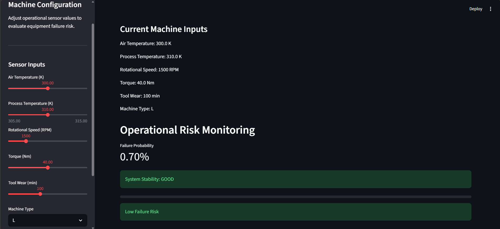
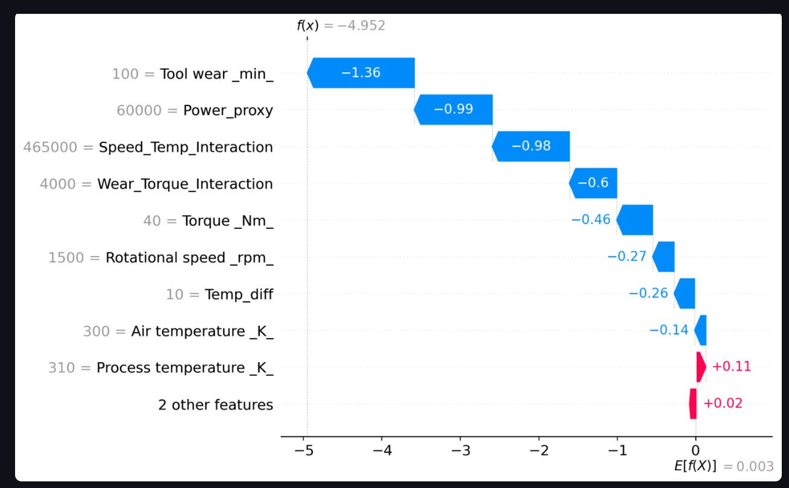
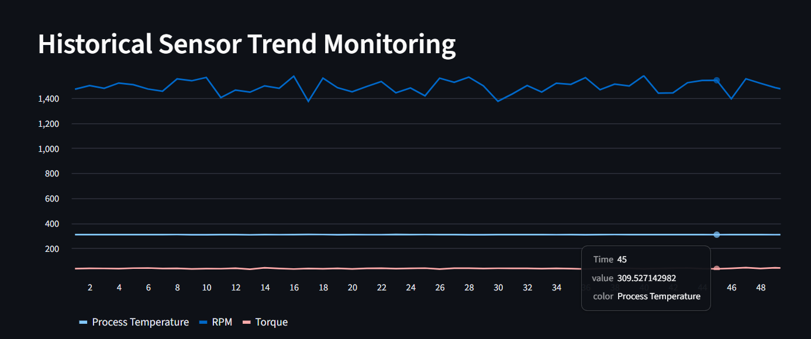

# ⚙️ Industrial Equipment Failure Prediction System

AI-powered predictive maintenance dashboard for industrial equipment using machine learning, operational analytics, and explainable AI.

---

# 📌 Project Overview

This project predicts industrial equipment failure risk using sensor-based operational data.

The system uses:
- XGBoost Machine Learning
- Predictive Maintenance Analytics
- SHAP Explainability
- Streamlit Dashboard
- Industrial Feature Engineering

The goal is to detect machine failure risk before operational breakdown occurs.

---

# 🚀 Features

## ✅ Predictive Maintenance
- Failure risk prediction
- Failure probability estimation
- Real-time sensor analysis

## ✅ Explainable AI
- SHAP waterfall plots
- Feature contribution analysis
- Operational interpretation

## ✅ Interactive Dashboard
- Live sensor monitoring
- Historical trend simulation
- Risk visualization
- Maintenance report download

## ✅ Industrial Feature Engineering
Custom engineered operational features:
- Temperature Difference
- Power Proxy
- Wear-Torque Interaction
- Speed-Temperature Interaction

---

# 🧠 Machine Learning Workflow

## 1. Data Understanding
- Industrial sensor analytics
- Failure distribution analysis
- Correlation analysis

## 2. Data Preprocessing
- Leakage feature removal
- One-hot encoding
- Class imbalance handling

## 3. Modeling
Models explored:
- Logistic Regression (baseline)
- XGBoost Classifier (final model)

## 4. Imbalance Handling
Used:
- `scale_pos_weight`
- Recall-focused evaluation

## 5. Explainability
Implemented:
- SHAP Explainable AI

---

# 📊 Model Performance

| Metric | Value |
|---|---|
| Accuracy | 97% |
| Recall | 88% |
| F1 Score | 71% |

The system prioritizes high recall to minimize missed equipment failures.

---

# 🖥️ Dashboard Preview

## Main Features
- Real-time failure prediction
- Sensor monitoring
- Trend visualization
- SHAP explainability
- Downloadable maintenance reports

## Main Dashboard



---

## SHAP Explainability



---

## Historical Trend Monitoring



---

# 🛠️ Tech Stack

- Python
- Pandas
- NumPy
- Scikit-learn
- XGBoost
- SHAP
- Streamlit
- Plotly

---

# 📂 Project Structure

```bash
industrial-equipment-failure-prediction/
│
├── dashboard/
│   └── app.py
│
├── data/
│   ├── raw/
│   └── processed/
│
├── models/
│   ├── xgb_model.pkl
│   └── feature_columns.pkl
│
├── notebooks/
│   └── 01_data_understanding.ipynb
│
├── screenshots/
│
├── requirements.txt
├── README.md
```

---

# ▶️ Run Locally

## 1. Clone Repository

```bash
git clone <your-repo-link>
```

## 2. Install Requirements

```bash
pip install -r requirements.txt
```

## 3. Run Streamlit App

```bash
cd dashboard
streamlit run app.py
```

---

# 📈 Future Improvements

- Real-time IoT integration
- Live streaming sensor data
- LSTM-based temporal modeling
- Cloud deployment
- Alert notification system

---

# 👨‍💻 Author

Binayak Bal

Biomedical Engineering | Machine Learning | Industrial Analytics